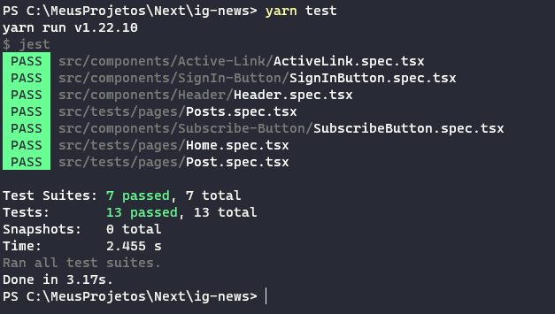

### Simple Blog with Next.js

## Description

This is a small application but with a lot of core concepts using React, Next and Typescript. 

The user could sign in with a Github account and then subscribe with a fake payment with Stripe(please use card number 424242424242) to see the complete content of a post. 🤗

👨‍💻 Front-end: React, Next with Typescript

🌟 Styles : Sass modules

💲 Payments : Stripe

🚩Database : Fauna DB

🔐Authentication : using NextAuth to sign in with GitHub account

⚡ Tests : Testing Library , Jest

